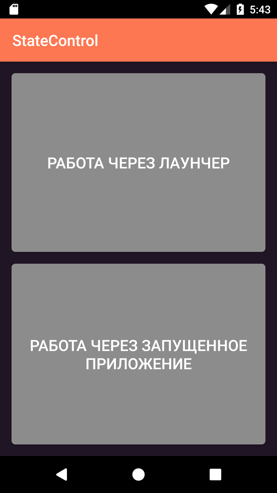
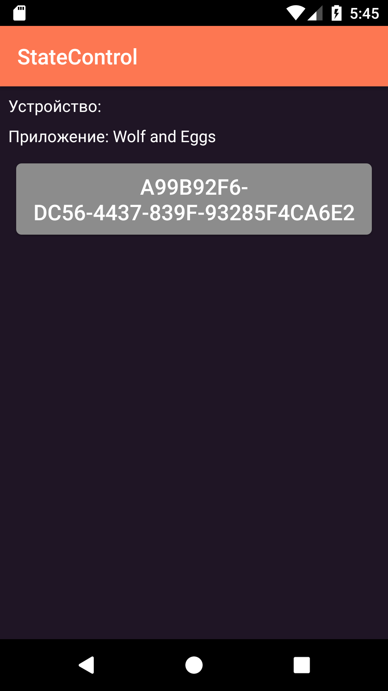
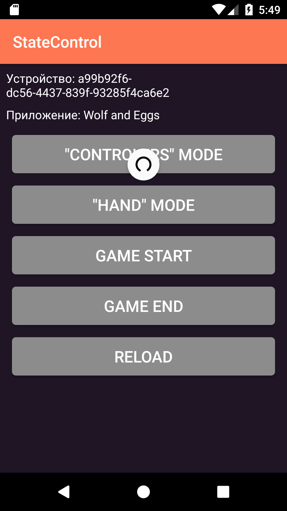

# Android часть системы "удаленное управление проектами в Unity"

## Скачать APK
 Скачать, установить и опробовать это приложение вы сможете перейдя по [этой ссылке](https://github.com/RealityFamily/StateControll_MobileAndroid/releases/).

## Сборка
 * Склонируйте репозиторий удобным вам способом;
 * Открыть проект в Android Studio 4.0+;
 * Установить, если нет, SDK версии 28;
 * Установить, если нет, Android 7.0+;
 * Проверить корректность и актуальность URL сервера в файле `string.xml` в поле `BaseURL`.

## Использование
 1. Проверить доступ к интернету на устройсте;
 2. Найти и открыть приложение;
 3. Нужно открыть вкладку "Работа через запущенное приложение"

    
 3. Выбрать необходимое приложение из списка запущенных;
    
    
 4. Выбрать необходимое устройство из списка работающих; (Идентификационный номер можно получить в управляемом приложении на другом устройстве)
    
    *{P.S. способ получения данной информации остается за разработчиком приложения на Unity}*
    
    
 5. Нажать на нужное состояние из предложенных.
    
    

 Если не получилось найти нужные данные в каком-то из пунктов, то вы можете обновить данные свайпом вниз или вернуться на шаг назад системной кнопкой "Назад".
 
 

 Однако даже если после этого вы не обнаружили необходимые данные, то убедитесь в том, что:
 * Данное устройство подклюено к сети;
 * Другое устройство на котором запущено управляемое приложение подключено к сети;
 * Другое устройство на котором запущено управляемое приложение получило свой идентификационный номер.
 
 Если все эти пункты выполнены корректно, но информации все так же нет, вы можете написать об этом [сюда](https://github.com/RealityFamily/StateControll_MobileAndroid/issues).